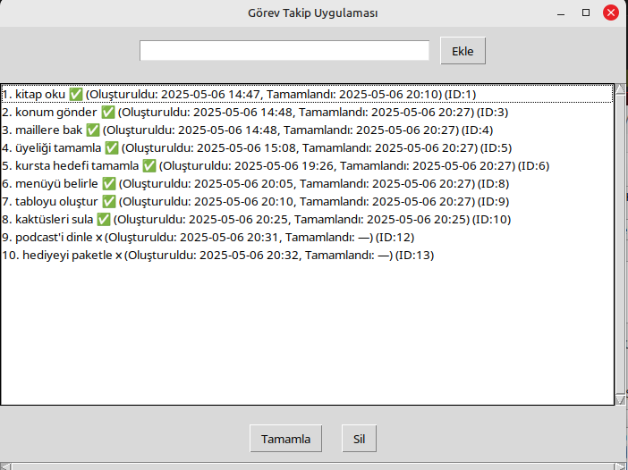
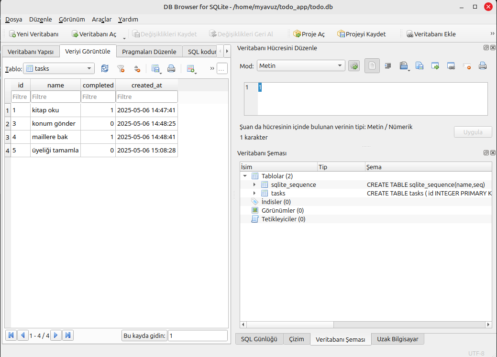

# Basit Görev Takip Uygulaması (todo.py)

Bu proje Python ve SQLite kullanılarak yapılmış basit bir komut satırı görev takip uygulamasıdır.

---

## Özellikler

- Görev ekleme  
- Görev listeleme  
- Görev tamamlama  

---

## Gereksinimler

- Python 3.x  
- sqlite3 (Python ile birlikte gelir)  

---

## Kurulum

1. Depoyu klonlayın:  
   ```bash
   git clone https://github.com/KULLANICIADIN/todo-app.git
   cd todo-app

## Grafik Arayüz (Tkinter)

Linux Mint ve Debian türevlerinde bir kez kurmak için:
```bash
sudo apt update
sudo apt install python3-tk
 



